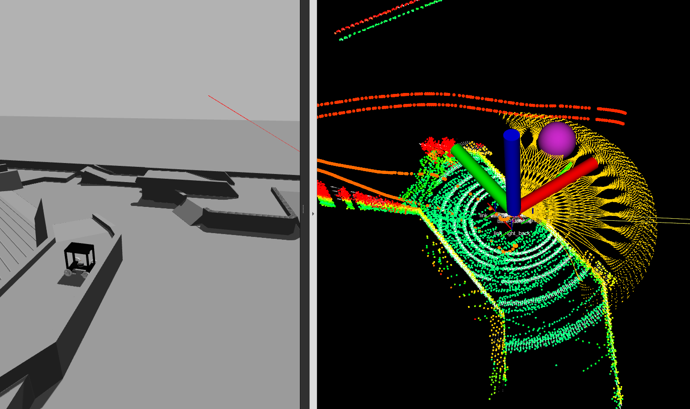

# sentry_sim
The simulation of  sentry in RoboMaster 2023/2024 season based on gazebo, [autonomous_exploration_development_environment](https://github.com/HongbiaoZ/autonomous_exploration_development_environment), [far_planner](https://github.com/MichaelFYang/far_planner)

https://github.com/66Lau/sentry_sim/assets/95697190/59206443-fcca-4397-8dfb-3bf6a5fa4ec9


## Environment Setting
- CPU:4800h
- GPU 2060
- RAM: 16G
- OS: Ubuntu 20.04
- ROS: noetic

Some files in `autonomous_exploration_development_environment`, `far_planner` package are modified, therefore, I recommend that using `noetic` as your ROS version and cloning from my repo directly. Because I added collison attribute for the robot and used different controller, which is different from the original version of the [autonomous_exploration_development_environment](https://github.com/HongbiaoZ/autonomous_exploration_development_environment).

```SHELL
sudo apt-get install xterm
sudo apt install libusb-dev

cd ~
mkdir ws_sentry_sim
cd ws_sentry_sim
mkdir src
cd src
git clone git@github.com:66Lau/sentry_sim.git
cd ..
catkin_make
```

## Launch Simulation
```SHELL
cd ws_sentry_sim
source devel/setup.bash
roslaunch sentry_gazebo startup_rmuc.launch
```

<!-- https://github.com/66Lau/sentry_sim/assets/95697190/a8513286-9576-4109-98dd-e6898c791bb9

https://github.com/66Lau/sentry_sim/assets/95697190/b711e6e7-a677-423d-bf40-183172f097cb -->

<div align="center"></div>
<div align="center">Uphill</div>
<br>

<div align="center"></div>
<div align="center">Navigation in bumopy road</div>
<br>

<div align="center"></div>
<div align="center">Global navigation(far_planner)</div>
<br>


## Reference
Appreciate!
- [CMU-autonomous_exploration_development_environment](https://github.com/HongbiaoZ/autonomous_exploration_development_environment)
- [CMU-FAR-planner](https://github.com/MichaelFYang/far_planner)
- [KDRobot_RM2023Sentry_Navigation](https://github.com/Wangben1019/KDRobot_RM2023Sentry_Navigation)
- [Hbut_LC_sentry](https://github.com/HBUTHUANGPX/Hbut_LC_sentry)

## Some Problems/Bugs


<div align="center"></div>
<div align="center">Drop</div>
<br>

When lidar are not able to scan the ground below the cliff, the system would grant cliff passable. It may be solved by set "useSorting" to false.

<!-- 
调参理解

local_planner.launch 中的 twoWayDrive 在rm场景下没有必要允许双头运行，有时候会导致摇摆
terrain_analysis中的 useSorting 打开比较好，因为那样子对于地面的划分就不会过于依靠绝对高度，而是会在已知点云中按照高度排序，划分地面层
terrain_analysis中的 maxGroundLift 在对点云分类到障碍物或者地面起作用，这个值越大，能上越陡的坡

第一套：原始参数
第二套：twoWayDrive->false
        minRelZ->-2.5
        maxGroundLift->2.0
        useSorting->true


 -->